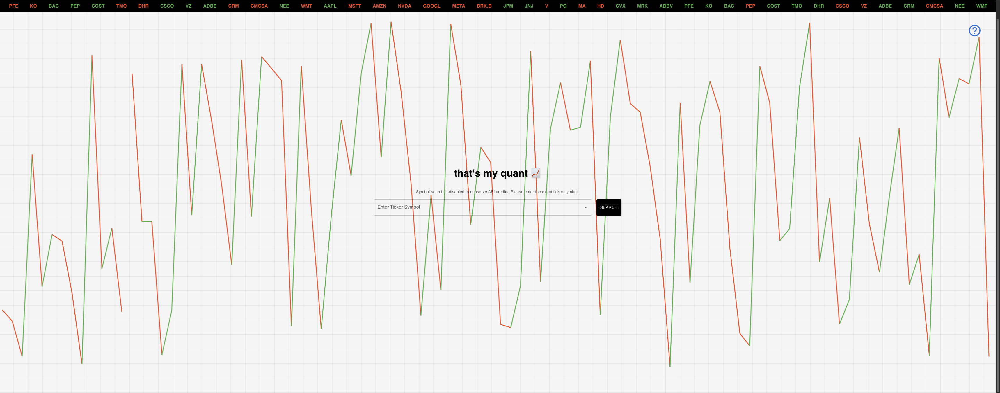

# That's My Quant

A comprehensive financial analysis and stock tracking platform that combines data analysis notebooks with a modern web application for stock tracking.

## Project Components

### Notebooks

The `notebooks` directory contains Jupyter notebooks for financial data analysis and visualization:

- `dashboard.ipynb`: Interactive dashboard for financial metrics and analysis
- `categorize_transactions_v1.ipynb`: Initial version of transaction categorization system
- `categorize_transactions_v2.ipynb`: Enhanced version of transaction categorization with improved algorithms

These notebooks provide the analytical foundation for the project, handling data processing, analysis, and visualization of financial information.

### Stock Tracker



The stock tracker application provides a sleek, real-time interface for monitoring market data:

Key features visible in the interface:
- Company profiles and fundamentals
- Earnings calendar and financial metrics

The `stock-tracker` directory contains a modern web application built with TypeScript and Vite. This component provides:

- Real-time stock tracking
- Interactive charts and visualizations
- Portfolio management features
- User-friendly interface for monitoring investments

#### Technical Stack
- TypeScript
- Vite
- Modern web development tools and frameworks

## Getting Started

### Notebooks Setup
1. Ensure you have Python and Jupyter installed
2. Install required Python packages (requirements.txt to be added)
3. Open notebooks in Jupyter Lab or Jupyter Notebook

### Stock Tracker Setup
1. Navigate to the stock-tracker directory
2. Install dependencies:
   ```bash
   npm install
   ```
3. Start the development server:
   ```bash
   npm run dev
   ```

## Data

The `data` directory contains datasets and resources used by both components of the project.

## Contributing

Feel free to contribute to this project by:
1. Forking the repository
2. Creating a feature branch
3. Submitting a pull request

